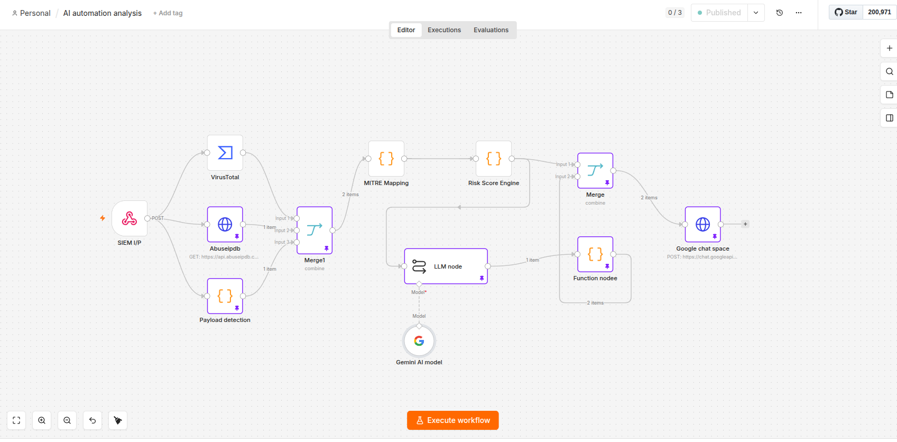
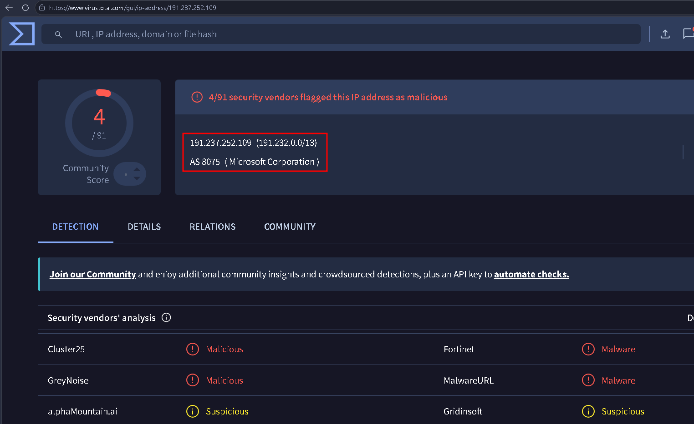

# SOC Alert Enrichment & Automation

> Automated SOC alert enrichment and AI-driven incident analysis workflow integrating SIEM data, threat intelligence, payload detection, MITRE ATT&CK mapping, risk scoring, and automated SOC reporting.

---

## Project Overview

This project automates security alert enrichment and AI-driven incident analysis by combining threat intelligence, payload detection, MITRE ATT&CK mapping, risk scoring, and automated SOC reporting.

The workflow receives security alert data, enriches the alert with threat intelligence and contextual information, analyzes the observed payload and attack activity, maps relevant behavior to MITRE ATT&CK techniques, calculates a risk score, and uses Gemini AI to generate a structured incident analysis.

The final analysis is automatically processed and delivered to Google Chat for SOC analyst review.

---

## 🔄 SIEM Data Pipeline

Python was used to retrieve security logs from Wazuh and push the log data into Redis. The logs were then forwarded from Redis directly to OpenSearch for centralized storage, monitoring, and analysis.

### Data Pipeline

**Wazuh → Python → Redis → OpenSearch**

This pipeline provides the underlying security data used for centralized monitoring, analysis, and downstream SOC automation.

---

## Workflow Architecture

  

### Workflow Flow

**SIEM IP → VirusTotal / AbuseIPDB / Payload Detection → Merge → MITRE Mapping → Risk Score Engine → LLM / Gemini AI → Merge → Function Node → Google Chat**

---

## Workflow Components

| Component | Purpose |
|---|---|
| **SIEM IP** | Receives security alert data from the SIEM and triggers the automation workflow |
| **VirusTotal** | Enriches the source IP with threat intelligence and reputation information |
| **AbuseIPDB** | Provides additional source IP reputation and abuse-confidence context |
| **Payload Detection** | Analyzes alert payload information and identifies suspicious attack patterns |
| **Merge** | Combines alert data with enrichment and payload analysis results |
| **MITRE Mapping** | Maps identified attack behavior to relevant MITRE ATT&CK techniques |
| **Risk Score Engine** | Calculates a risk score based on the enriched alert context |
| **LLM Node** | Processes the enriched security alert and generates AI-driven incident analysis |
| **Gemini AI Model** | Provides the AI model used for automated security alert analysis |
| **Merge** | Combines the generated analysis with the required alert context for reporting |
| **Function Node** | Processes and structures the generated analysis into a readable SOC report |
| **Google Chat Space** | Delivers the final automated SOC analysis to the analyst/team |

---

## Security Capabilities

- Automated security alert ingestion
- Automated threat intelligence enrichment
- Source IP reputation analysis
- Attack and payload classification
- MITRE ATT&CK technique mapping
- Risk scoring
- AI-driven incident analysis
- Automated SOC reporting
- Security workflow automation
- Centralized security data processing
- Centralized delivery of investigation findings

---

## Technologies Used

**SIEM:** Wazuh, OpenSearch  
**Log Ingestion & Processing:** Python, Redis  
**Automation:** n8n  
**Threat Intelligence:** VirusTotal, AbuseIPDB  
**Detection & Framework:** MITRE ATT&CK  
**AI:** Gemini AI  
**Integration:** REST APIs  
**Infrastructure:** Docker  
**Notification:** Google Chat

---

## Threat Intelligence Enrichment

The workflow enriches security alerts with external threat intelligence to provide additional context around source IPs involved in suspicious activity.

  

Threat intelligence enrichment provides additional reputation and contextual information that can support alert investigation and risk assessment.

---

## 🤖 AI-Driven Incident Analysis

Following alert enrichment and contextual analysis, the workflow passes the relevant security information to Gemini AI to generate a structured incident analysis.

  

The generated analysis provides SOC analysts with a structured view of the observed security activity, attack context, and relevant investigation findings.

---

## Security Value

The workflow reduces repetitive manual enrichment and analysis tasks by automatically combining:

**Alert Data + Threat Intelligence + Payload Analysis + MITRE ATT&CK + Risk Assessment + AI-Driven Analysis**

This enables SOC analysts to obtain enriched investigation context faster and receive a consistent, structured analysis of security alerts.

---

## Project Focus

**SOC Automation • Detection Engineering • Threat Intelligence • MITRE ATT&CK • Security Data Enrichment • SIEM Engineering • AI-Driven Incident Analysis**
